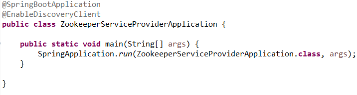
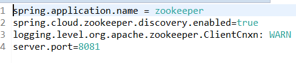

# Service Discovery Using Apache Zookeeper
ZooKeeper is a centralized service for maintaining configuration information, naming, providing distributed synchronization, and providing group services. In this project we will use **Spring Cloud Zookeeper** for integrating Apache Zookeeper to Spring boot. This project consists of two applications,
* zookeeper-service-consumer 
* zookeeper-service-provider

 in which the zookeeper-service-consumer will use one of the API of zookeeper-service-provider. Apache Zookeeper will act as a coordinator in our service discovery setup. 
 
####1. Pre-requisite
  * Installation of Apache Zookeeper.
  
**Note:** The project was executed on Apache Zookeeper version 3.5.3. It won't work on any other previous versions.

####2. Maven Dependencies 

* **Zookeeper-Service-Consumer**

    1. spring-boot-starter-web.
    2. spring-cloud-starter-zookeeper-discovery.
    3. spring-cloud-starter-openfeign.
   
**We will be using feign-cloud for communication as Rest Template isn't supported by Spring Cloud Zookeeper.**
  
* **Zookeeper-Service-Provider**

    1. spring-boot-starter-web.
    2. spring-cloud-starter-zookeeper-discovery.
  
####3. Service Registration

@EnableDiscoveryClient. This will make the application discovery-aware: 

####4. Application Properties

The name of the application with which gets registered to Zookeeper is the most important. Later in the service consumer, a feign client will use this name during the service discovery:

* **Zookeeper-Service-Provider-**

  
  
**For accessing the zookeeper server remotely you can set spring.cloud.zookeeper.connect-string** = {server}:2181

####5. Running the Application

1. Start the zookeeper through command prompt.
2. Once the zookeeper is up and running, run the zookeeper-service-provider followed by zookeeper-service-consumer.
  